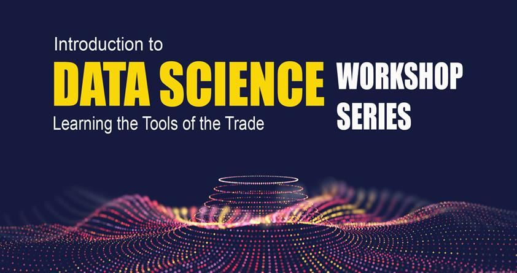

@snap[north span-100]
### Introduction to SQL for Data Science
@snapend

@snap[south-west text-08]
@fa[twitter](TheSandyCoder)
@snapend

@snap[south text-08]
@fa[github](davidrpugh)
@snapend

@snap[south-east text-08]
@fa[linkedin](davidrpugh)
@snapend

#### Dr. David R. Pugh
Staff Scientist, KVL

Certified Instructor, Software Carpentry

---?image=assets/img/nist-data-science-skillsets.jpg&size=75% 75%

@snap[north]
#### What is Data Science?
@snapend

---

## Why Should (Data) Scientists Learn SQL?

---?image=assets/img/data-science-programming-languages.png&size=75% 75%

@snap[north]
#### SQL is widely used...
@snapend

---

@snap[north span-100]
#### ...???
@snapend

TBD  
---
## SQL is only one tool in a (Data) Scientist's toolbox!

---
@snap[north span-100]
#### Other core (Data) Scientist skills
@snapend

@ul[spaced]
* Proficiency in a scripting language (Python or R)
* Version control using Git (and GitHub or GitLab)
* Shell programming 
* Working remotely with clusters
* Container-based workflows
@ulend

---
 
